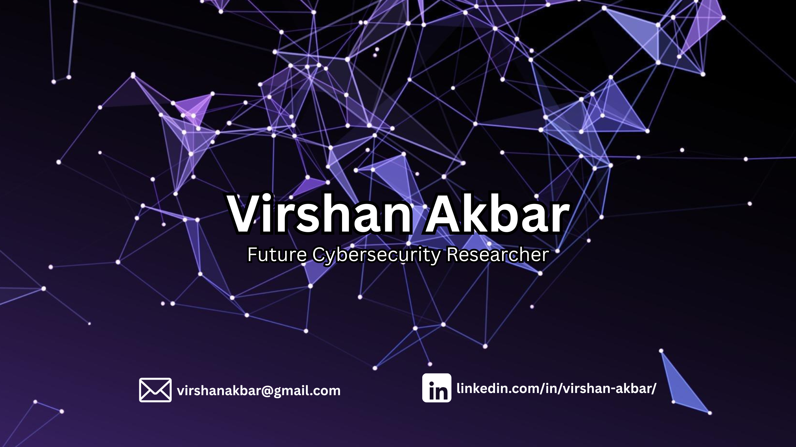

<h2 align="center">✨ About ✨</h2>

  Hello! My name is <b>Virshan Akbar</b>, students from Electronics and Instrumentations, Universitas Gadjah Mada, D.I.Yogyakarta, Indonesia 🇮🇩.

  My hobbies include reading comic/manga 📖, studying 📕, and playing CTF 🚩. My goals is to become cryptography researcher and system penetration tester 👨‍🏫. The road is still far ahead, that's why staying in confort zone is not an option. I must work hard and strive even further in order to reach my goal📍.

<h2 align="center">👨‍💻 Current Position 👨‍💻</h2>

  📓 Student at Universitas Gadjah Mada 

<h2 align="center">📚 Research Interests 🔬</h2>

  🔐 Cybersecurity 
  🖋️ Cryptography 
  🧠 Machine Learning 

<h2 align="center">💻 Tech Stack 🖥️</h2>

  
  
  
  

  
  
  
  
  

<h2 align="center">🌐 Socials 🌐</h2>

   

  
  

