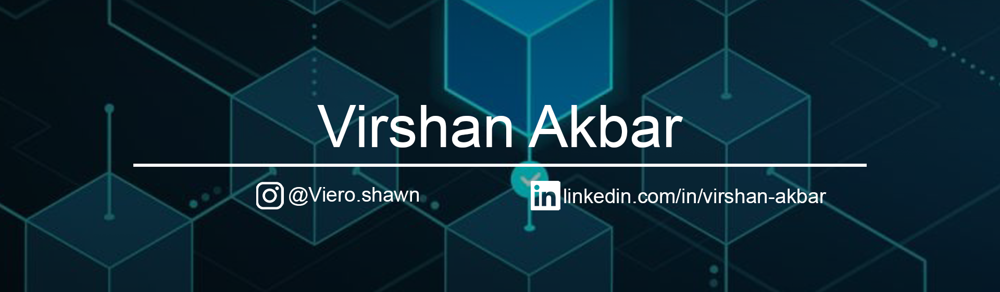

<h2 align="center">✨ About ✨</h2>

  Hello! My name is <b>Virshan Akbar</b>, students from Electronics and Instrumentations, Universitas Gadjah Mada, D.I.Yogyakarta, Indonesia 🇮🇩.

  My hobbies include playing video games 🎮, studying 📕, and looking at trading charts 📈. My goals is to become lecturer that research on cryptographic and blockchain topic 👨‍🏫. The road is still far ahead, that's why staying in confort zone is not an option. I must work hard and strive even further in order to reach my goal📍.

<h2 align="center">👨‍💻 Current Position 👨‍💻</h2>

  📓 Student at Universitas Gadjah Mada 
  🔭 Researcher at Elins Research Club 
  🛰️ Electrician at Gadjah Mada Aerospace Team 

<h2 align="center">📚 Interests 🔬</h2>

  📊 Data Science 
  🤖 Artificial Intelligent 
  🧠 Machine Learning 
  ⛓ Blockchain Technology 
  🖋️ Cryptography 
  🔠Cyber Security 

<h2 align="center">💻 Tech Stack 🖥️</h2>

  
  
  
  

  
  
  
  
  

<h2 align="center">🌐 Socials 🌐</h2>

   

  
  

